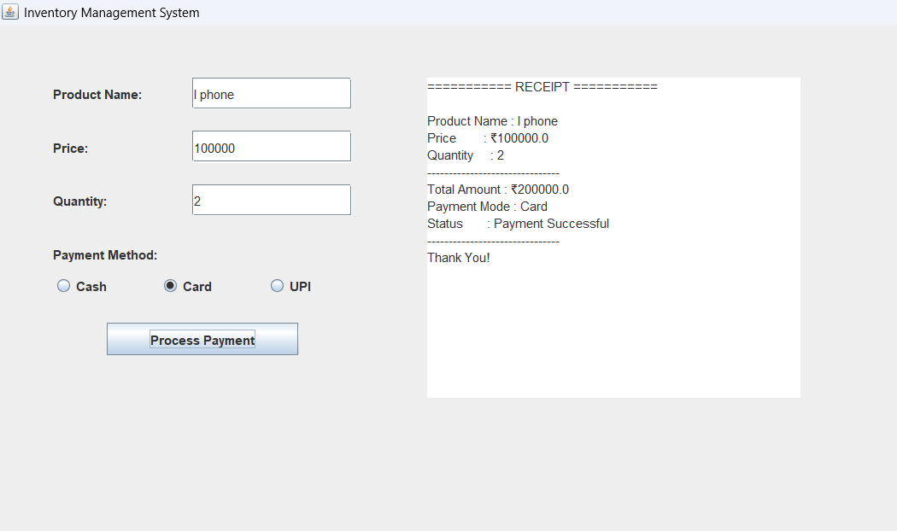

# 📦 Inventory Management System

## 📌 Project Description

This project is a Java-based Inventory Management System developed to manage product details and simulate different payment methods. It provides a simple graphical interface where users can enter product information, select a payment mode, and generate a receipt. The system is designed to demonstrate core programming concepts in a practical way.

## 📌 Overview

A Java application with GUI (Swing) that demonstrates OOP concepts like interfaces and polymorphism.

## 🚀 Features

* Product entry (name, price, quantity)
* Multiple payment methods (Cash, Card, UPI)
* Receipt generation
* Simple and user-friendly interface

## 🛠️ Technologies

* Java
* Swing

## ▶️ How to Run

```bash
javac *.java
java AppGUI
```

## 📸 Output


## 👩‍💻 Author

Soujanya P M
